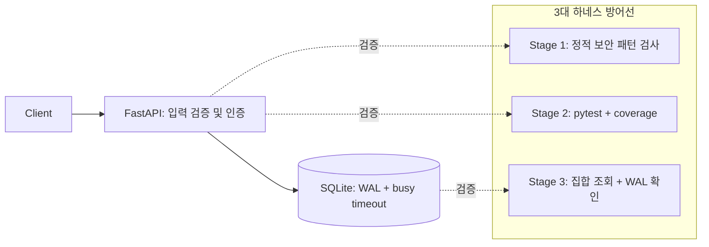

# Campus Todo: 보안 가드레일과 하네스로 검증하는 FastAPI 서비스


> AI가 만든 API의 SQL 처리, 자격증명, 조회 복잡도, DB 동시성 문제를 코드 개선과 재현 가능한 하네스로 검증하는 프로젝트입니다.

## 1. 프로젝트 개요 & 문제 정의

FastAPI와 SQLite로 Todo 생성·조회·수정·관리자 삭제, 검색, 금지 태그 필터링을 제공합니다. 기존 사용자 등록·로그인 및 아이템 API도 유지합니다.

저장소 HEAD의 초기 코드에는 문자열 보간 SQL, 공유 관리자 자격증명, MD5, 중첩 반복문 중복 제거가 있었습니다. 현재 코드는 SQL 바인딩, 환경변수, Salt를 포함한 SHA-256, Hash Set, WAL과 busy timeout으로 개선했습니다. 하네스 실행 → 실패 원인 수정 → 재검증으로 기능과 방어 동작을 함께 확인합니다.



하네스는 요청 처리 경로 밖에서 실행합니다. 별도 `harness/simulate_load.py`로 SQLite 쓰기 부하를 측정합니다.

## 2. Before vs After 정량 비교

측정일: **2026-10-07**, Windows / Python 3.12 / 로컬 SQLite. DB 부하 조건: **총 1,000건, 동시 작업자 20명**. HTTP 요청 1,000건이 동시에 접속한 실험은 아닙니다.

| 지표 | Before | After | 해석 |
|:---|:---|:---|:---|
| 중복 제거 전체 복잡도 | O(N²) 중첩 비교 | O(N), 추가 공간 O(N) | 각 ID의 집합 조회는 평균 O(1) |
| 금지 태그 조회 | 태그마다 목록 순회 | 집합 조회 평균 O(1) | 전체 처리량은 Todo 및 태그 수에 비례 |
| DB 쓰기 실패율 | 26.0% (260/1,000건) | 0.00% (0/1,000건) | 이번 시뮬레이션 측정값 |
| DB 처리량 | 157.5 ops/s | 529.9 ops/s | 약 3.4배 증가 |
| DB 작업 p99 지연 | 450.71ms | 1,313.21ms | 꼬리 지연 증가, 100ms 미충족 |
| API 문장 커버리지 | 초기 기준 미측정 | 100% (175/175문장) | pytest 6개로 측정 |
| 하네스 집합 조회 | 기준 미측정 | 1.66ms | 집합 생성 및 조회 1,000회 합산 |

**실험 범위:** Before에는 `BEGIN EXCLUSIVE`, 80ms timeout, 인위적인 2ms 대기가 있고, After에는 WAL, 5초 timeout, `synchronous=NORMAL`을 적용합니다. 조건이 함께 바뀌므로 개선을 WAL 단독 효과로 해석할 수 없습니다. 이 결과는 HTTP 지연 또는 장기 가용성 SLA를 증명하지 않습니다. 오류율이 줄어도 대기 시간은 늘 수 있었습니다.

## 3. 핵심 엔지니어링 구현 내용

### 시간 복잡도와 데이터 접근

- `deduplicate_records()`는 `seen_ids`로 최초 등장 순서를 유지하며 중복을 제거합니다.
- 금지 태그는 집합으로 변환해 반복적인 목록 탐색을 줄입니다.
- ID와 사용자명 조회는 기본 키 및 UNIQUE 인덱스를 사용합니다. `%키워드%` 검색에는 전체 스캔이 발생할 수 있어, 규모 확장 시 전문 검색 설계가 필요합니다.

### 보안 가드레일

| 방어 대상 | 구현 | 검증 |
|:---|:---|:---|
| CWE-89: SQL Injection | 외부 입력을 SQLite `?` 매개변수로 전달 | 공격 문자열 등록·검색·로그인·아이템 생성 테스트 |
| CWE-798: 하드코딩 자격증명 | `os.getenv()`, 미설정 관리자 인증 차단 | 잘못된 토큰 및 미설정 자격증명 테스트 |
| CWE-327: 취약 해시 | SHA-256 + Salt, `hmac.compare_digest()` | 저장 해시와 비밀번호 검증 테스트 |
| SQLite 락 경합 | WAL 및 연결별 `busy_timeout=5000` | 실제 WAL 확인 및 별도 DB 부하 실험 |
| 입력 계약 | Pydantic 검증 및 공백 제목 거부 | 생성·수정 입력 방어 테스트 |

`PASSWORD_SALT`는 재시작 후 로그인 일관성을 위해 고정된 환경변수로 설정해야 합니다. 미설정 시 프로세스별 난수를 사용합니다. 기존 MD5 비밀번호는 재설정이 필요합니다.

실습용 인증 구조에는 한계가 있습니다. 기존 사용자 로그인은 공유 legacy 토큰을 반환하며 Todo 생성·조회·수정에는 사용자별 접근 제어가 없습니다. SHA-256 + 공유 Salt는 운영용 비밀번호 저장에 필요한 느린 해시와 사용자별 Salt를 대체하지 않습니다. 정적 검사 발견 0건은 검사 패턴의 결과이며 전체 취약점 부재를 뜻하지 않습니다.

### 하네스 자율 개선

Windows에서 실패하던 `python3` 호출을 현재 인터프리터인 `sys.executable`로 변경했습니다. 테스트 부재 시 게이트가 실패하며, API 문장 커버리지 **85% 이상**을 강제합니다. 부하 시뮬레이터는 실패한 DB 작업에서도 연결을 닫아 Windows 파일 정리 오류를 해결했습니다.

## 4. 설치·실행 및 3대 하네스 검증

### PowerShell 퀵스타트

저장소 폴더에서 실행합니다. 패키지 설치 시간은 환경에 따라 다릅니다.

```powershell
python -m venv .venv
.\.venv\Scripts\python.exe -m pip install -r requirements.txt
$env:ADMIN_PASSWORD = Read-Host '관리자 비밀번호'
$env:ADMIN_TOKEN = (.\.venv\Scripts\python.exe -c "import secrets; print(secrets.token_hex(32))")
$env:LEGACY_API_TOKEN = (.\.venv\Scripts\python.exe -c "import secrets; print(secrets.token_hex(32))")
$env:PASSWORD_SALT = (.\.venv\Scripts\python.exe -c "import secrets; print(secrets.token_hex(32))")
.\.venv\Scripts\python.exe -m uvicorn main:app --reload --port 8000
```

API 문서: [Swagger UI](http://localhost:8000/docs). `.env.example`은 설정 항목 안내이며 `.env` 자동 로딩은 구현하지 않습니다. 재시작할 때도 토큰과 Salt를 유지하도록 안전하게 보관해 재사용하세요. `DB_FILE` 기본값은 `service.db`입니다.

### 검증 명령

```powershell
$env:PYTHONIOENCODING = 'utf-8'
.\.venv\Scripts\python.exe harness/check_harness.py
.\.venv\Scripts\python.exe -m pytest tests -v
.\.venv\Scripts\python.exe harness/simulate_load.py --requests 1000 --concurrency 20
```

Linux/macOS에서는 Python 경로를 `.venv/bin/python`으로 바꿉니다.

최종 로컬 결과:

```text
Stage 1: PASS — 정적 패턴 검사 발견 0건
Stage 2: PASS — 6 passed, main.py 문장 커버리지 100%
Stage 3: PASS — 집합 생성/조회 1.66ms < 100ms, WAL 설정 확인
[100% GREEN] 모든 로컬 하네스 검증 통과
harness_report.json: APPROVED, total_failures: 0
```

Stage 1은 이름과 달리 AST를 파싱하지 않는 정규식 검사입니다. Stage 3은 실제 API p99 또는 동시 쓰기를 직접 검증하지 않습니다. GitHub PR 보안 리뷰 워크플로우는 존재하지만 이번 작업에서 원격 CI/CD 실행 또는 배포 성공을 확인하지 않았습니다.

HTTP 부하는 별도 테스트 DB로 서버를 실행한 뒤 다음 명령으로 측정할 수 있습니다. Todo 1,000건이 생성됩니다.

```powershell
.\.venv\Scripts\python.exe harness/simulate_load.py --url http://localhost:8000/todos --requests 1000 --concurrency 20
```

## 5. 엔지니어링 회고

초록색 하네스만으로 운영 준비를 판단할 수 없습니다. 실제 앱을 측정하는지, 부하 조건이 동일한지, 오류율 개선과 꼬리 지연 증가가 함께 나타나는지 확인해야 합니다. 다음 목표는 실제 HTTP p99 계측, 동일 조건 WAL 비교, 사용자별 인증 및 접근 제어입니다.
